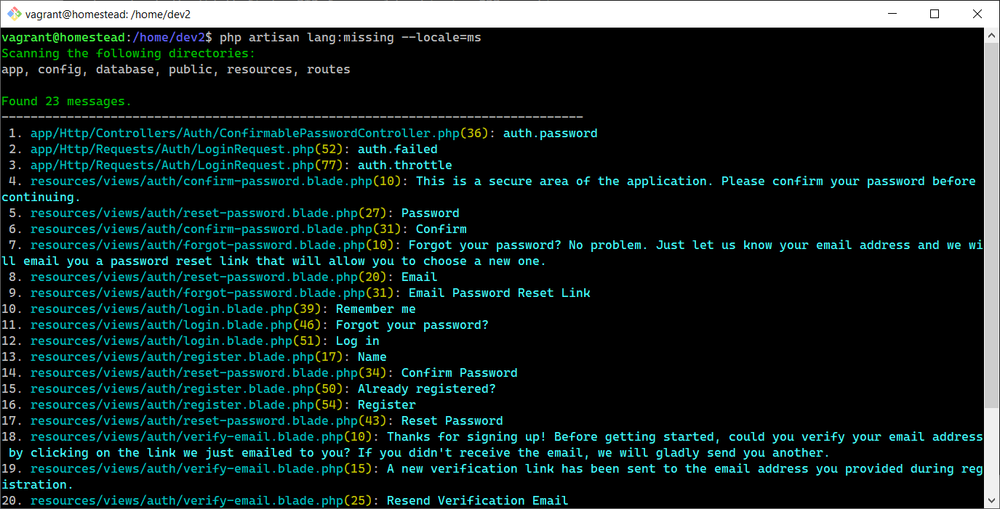

# Laravel Language Helper

[](https://packagist.org/packages/apih/laravel-lang-helper)
[](https://packagist.org/packages/apih/laravel-lang-helper)
[](https://packagist.org/packages/apih/laravel-lang-helper)

This package provides helper commands that can be used in managing and organizing language localization messages.



## Requirements

- PHP: `^8.0`
- Laravel: `^8.0|^9.0|^10.0`

## Installation

You can install the package via Composer:

```bash
composer require apih/laravel-lang-helper --dev
```

The `Apih\LangHelper\LangHelperServiceProvider` class is auto-discovered and registered by default.

If you want to register it yourself, add the service provider in `config/app.php`:

```php
'providers' => [
    /*
     * Package Service Providers...
     */
    Apih\LangHelper\LangHelperServiceProvider::class,
],
```

## Usage

### Find Missing Translations

You can find messages with missing translations with:

```bash
php artisan lang:missing --locale=ms
```

This command will list all messages with missing translations for the target locale.

By default, this command will scan the following directories:

```
app, config, database, public, resources, routes
```

If you need to add additional directories, use `add-dirs` option:


```bash
php artisan lang:missing --locale=ms --add-dirs=src
```

### Find Duplicates In JSON Files

You can find keys which have same translation message in JSON files with:

```bash
php artisan lang:json:duplicates
```

### Sort Messages In JSON Files

You can sort translation messages alphabetically in JSON files with:

```bash
php artisan lang:json:sort
```

## Security Vulnerabilities

If you discover any security related issues, please email <hafizuddin_83@yahoo.com> instead of using the issue tracker. Please prefix the subject with `Laravel Lang Helper:`.

## Credits

- [Mohd Hafizuddin M Marzuki](https://github.com/apih)
- [All Contributors](../../contributors)

## License

The MIT License (MIT). Please see [License File](LICENSE.md) for more information.
